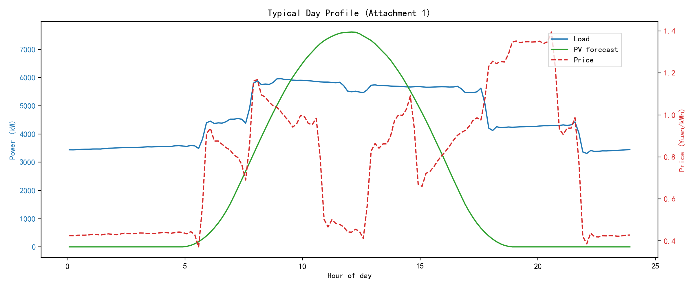
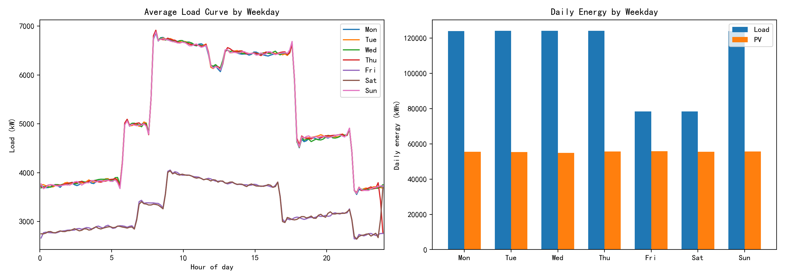
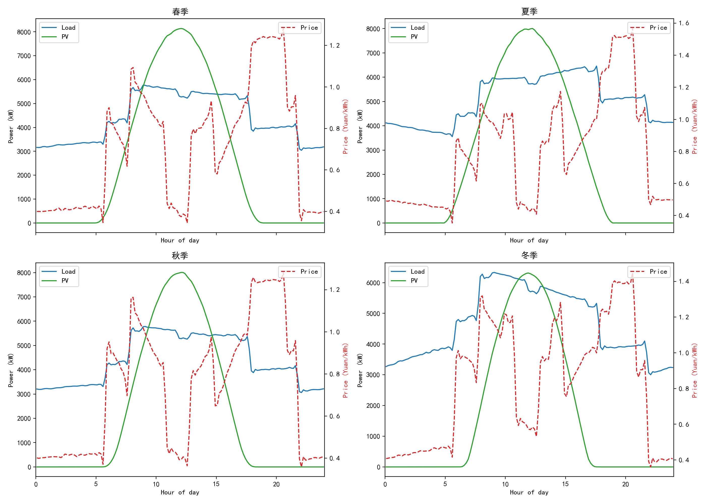
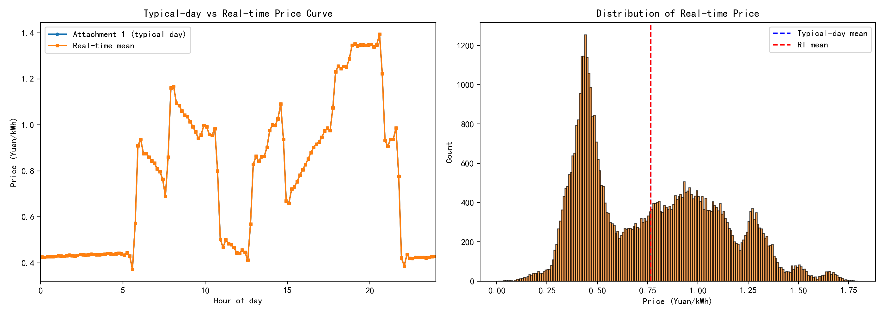
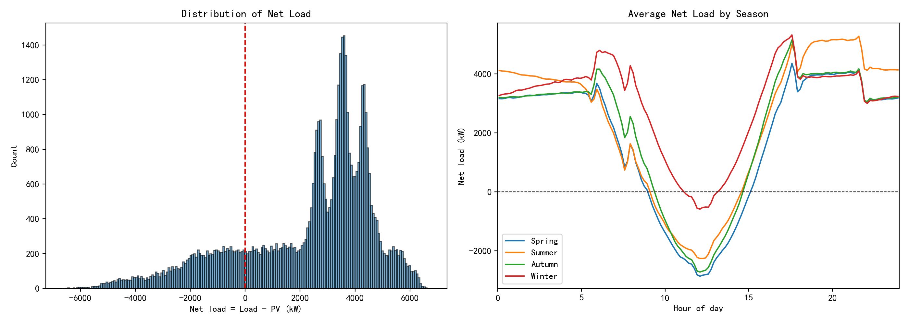
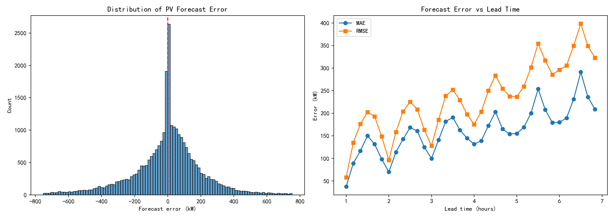
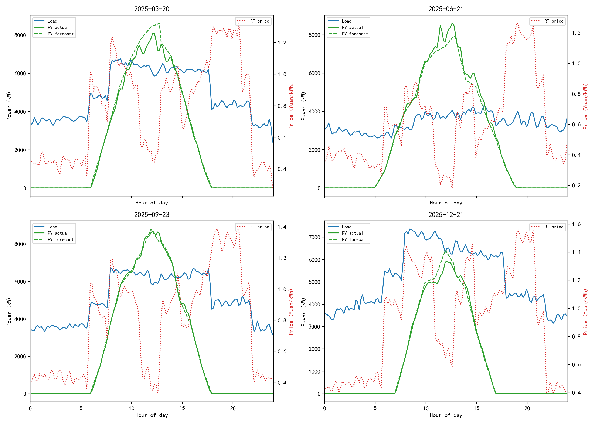

# 2026 CUMCM C 题数据特征分析报告

## 1. 数据来源与处理

本分析基于赛题提供的 4 个附件：

- **附件 1**：某典型日的电价、小区负载、光伏发电预测功率（144 个 10 分钟时段）。
- **附件 2**：2025 全年小区负载与光伏发电实际功率（365 天 × 144 时段）。
- **附件 3**：2025 全年每天 0:00/6:00/12:00/18:00 起报的未来 24 小时整点光伏预报。
- **附件 4**：2025 全年实时电价（365 天 × 144 时段）。

处理流程：

1. 统一时间索引为 `(date, slot)`，`slot = 0..143`，每个 slot 代表 10 分钟。
2. 附件 2、4 的宽表通过 `melt` 转为长表；`0:00+1` 映射到当日最后一个 slot（143）。
3. 附件 3 的整点预报通过**线性插值**得到 10 分钟功率，并按「每个 slot 取可用的最新起报」构建 operational forecast。
4. 合并为统一主表 `full_timeseries.parquet`，并计算日/月/季节特征。

输出文件位于：

- `data/processed/`：清洗后的 CSV/Parquet/NPZ。
- `figures/`：可视化图片。

## 2. 关键数字摘要

| 指标 | 数值 |
|---|---|
| 全年负载电量 | **40.52 GWh** |
| 全年光伏电量（实际） | **20.25 GWh** |
| 光伏占负载比例 | **50.0%** |
| 平均实时电价 | **0.7662 元/kWh** |
| 实时电价范围 | **0.0076 – 1.7936 元/kWh** |
| 典型日（附件 1）电价范围 | **0.3713 – 1.3952 元/kWh** |
| 光伏预测 MAE / RMSE | **161.8 / 246.8 kW** |
| 光伏预测 sMAPE / MBE | **24.3% / −10.9 kW** |
| 净负载 > 0（需购电）时段占比 | **80.7%** |
| 全年缺电量（净负载>0 部分） | **23.39 GWh** |
| 全年光伏富余（净负载<0 部分） | **3.12 GWh** |
| 净负载范围 | **−6602 ~ +6688 kW** |

## 3. 主要数据特征

### 3.1 典型日曲线（附件 1）



- 电价呈现明显的**三峰一谷**：早间、午后、晚间三个高峰，夜间低谷。
- 负载在 8:00 左右快速上升，午间略有回落，下午至傍晚保持高位，夜间下降。
- 光伏从 7:00 前后开始出力，12:00 左右达到峰值，17:00 后逐渐归零。
- 注意：附件 1 的**典型日电价曲线与附件 4 实时电价的全年均值几乎完全重合**，说明典型日电价很可能是实时电价的典型日/平均形态。

### 3.2 星期效应



- **周五、周六负载显著偏低**：日用电量约为周一~周四的 60%–65%。
- 周日负载恢复到工作日水平。
- 日内形态上，周五、周六白天峰值明显降低，夜间形态与其他日子相近。
- 光伏发电量几乎不随星期变化，主要由季节和天气决定。

### 3.3 季节特征



| 季节 | 日均负载 (kWh) | 日均光伏 (kWh) | 平均电价 (元/kWh) | 日均 MAE (kW) |
|---|---|---|---|---|
| 春季 | 105,200 | 62,474 | 0.705 | 169 |
| 夏季 | 121,530 | 64,151 | 0.795 | 172 |
| 秋季 | 105,749 | 54,634 | 0.734 | 167 |
| 冬季 | 111,574 | 40,335 | 0.832 | 131 |

- **夏季负载最高**（空调制冷），**冬季电价最高**。
- **夏季光伏峰值最高、日照时间最长**；冬季光伏出力最低。
- 冬季光伏预测误差绝对值最小，但相对比例可能更高。

### 3.4 实时电价特征



- 实时电价分布呈**双峰或多峰**：低价区集中在 0.3–0.5 元/kWh，高价区集中在 0.8–1.4 元/kWh。
- **全年实时电价均值与典型日电价均值完全相等（均为 0.7662 元/kWh）**，说明附件 1 的典型日电价本质上是附件 4 实时电价的平均形态；但日内逐 10 分钟波动差异大。
- 日内最贵时段集中在 **20:30 前后（slot 123，均价 1.395 元/kWh）** 和傍晚 18:50–20:30；最便宜时段在 **凌晨 5:30 前后（slot 33，均价 0.371 元/kWh）** 与深夜。
- 极端电价：> 1.5 元/kWh 占 1.76%，< 0.2 元/kWh 占 0.57%。

### 3.5 净负载与购电压力



- 净负载 `Load - PV` 分布：
  - **80.7% 的时段净负载为正（需向外部电网购电）**，仅 19.3% 的时段光伏有富余。
  - 正值区集中在夜间和清晨，峰值 +6688 kW；负值区集中在白天，峰谷 −6602 kW。
- 全年缺电量（净负载>0 部分）**23.39 GWh**；全年光伏富余（净负载<0 部分）**3.12 GWh**——后者是储能可吸收、避免弃光的理论上限。
- 冬季净负载整体最高（光伏少），夏季白天净负载可大幅下降甚至为负。
- 日内负载峰值出现在 **9:00 前后（slot 54，5959 kW）**，谷值在 **22:00 前后（slot 132，3309 kW）**；光伏峰值在 **12:00（slot 72，7612 kW）**。

### 3.6 光伏预测误差



- 误差分布近似以 0 为中心的对称分布，但存在极端正负误差；整体偏差 **MBE = −10.9 kW**（预报略偏低）。
- 全天 MAE **161.8 kW**、RMSE **246.8 kW**、sMAPE **24.3%**。
- 由于每天 4 次（每 6 小时）更新预报，实际可用的 operational forecast **lead time 仅 1–6.8 小时**，误差随 lead time 增大：约 1 小时 MAE ≈ 35 kW，接近 6 小时 MAE 可达 250–300 kW。
- 这意味着问题 3 中 6:00/12:00/18:00 的滚动调整相比 0:00 计划有实际价值，尤其是在午后和傍晚的光伏预测修正上。

### 3.7 关键日期



- **2025-03-20（春分）**：光伏中等，午间可部分覆盖负载；实时电价波动大。
- **2025-06-21（夏至）**：光伏峰值高，午间出现明显净负载低谷；晚间电价高峰与光伏消失重叠，购电压力大。
- **2025-09-23（秋分）**：光伏出力接近夏季，负载也较高，净负载形态接近春夏季。
- **2025-12-21（冬至）**：光伏最低，全天净负载高企，购电压力最大；电价整体偏高。

## 4. 对四问建模的启示

### 问题 1

- 电价、负载固定，光伏已知，是确定性 LP/MILP。
- 储能应在**夜间低价时段（0:00–7:00）充电**，在**早间/午后/晚间高峰放电**。
- 由于光伏中午出力大，储能可吸收部分富余光伏（若允许），减少弃光。

### 问题 2

- 负载与光伏实际逐日变化，紧急购电价格为 5 倍，惩罚很重。
- 计划阶段应在 0:00 基于预测制定保守策略（预留储能电量），避免实际运行中触发紧急购电。
- 周五、周六负载低，计划购电量可相应减少。

### 问题 3

- 0:00/6:00/12:00/18:00 四次预报的误差随 lead time 增大，**引入滚动调整确实能降低总费用**。
- 调整费用结构（计划 > 调整：0.5 倍；调整 > 计划：1.5 倍）意味着：**宁可在 0:00 少计划一点**，也不要让调整量大幅超过计划（1.5 倍惩罚更重）。
- 模型需显式处理计划量与调整量的偏差惩罚。

### 问题 4

- 实时电价波动大，典型日电价只是其**日内平均**形态（两者均值完全相同，平均峰谷时段 Jaccard = 1.00）；但**单日**低价时段与典型日电价低价窗口只有 **54%** 重合。
- 若沿用典型日电价下的充电时段，约一半的「低价充电」会落空；因此需要滚动/MPC 策略或鲁棒优化，按实时电价动态调整。
- 电价短期自相关高达 0.96（10 分钟），支持用短滚动周期做实时修正。
- 高价时段净负载（4294 kW）约为低价时段（1203 kW）的 3.6 倍，减少高价购电的收益空间很大。

## 5. 还可进一步挖掘的数据特征

本阶段已完成基础 EDA。以下特征与四问建模直接相关，建议在建模前补齐：

### 5.1 储能价值相关（优先级最高）

1. **储能物理量级**（已计算）：
   - SOC 可用区间 9600 kWh，以 5000 kW 满充需 **1.92 h ≈ 11.5 个 slot**；
   - 单时段（10 分钟）最多充/放电 **833.3 kWh**；
   - 单日理论最大吞吐 19,200 kWh，约占日均负载的 **17.3%**——储能能削峰填谷，但无法完全平抑净负载，购电仍是主导成本项。
2. **峰谷价差与套利空间量化**：逐日计算低价/高价时段，结合 SOC 约束与效率 90%，求每日理论最大套利收益，作为问题 1 最优费用的下界参考。
3. **净负载峰谷差约 13,290 kW**（+6688 至 −6602），远超储能单时段功率，进一步印证上述结论。

### 5.2 电价结构（已量化，直接支撑问题 4）

4. **实时电价与典型日电价的峰谷重合度**：
   - 日内**平均**曲线：峰/谷时段 Jaccard 重合度 **1.00**，说明附件 1 典型日电价正是附件 4 实时电价的日内平均形态；
   - **单日**实时电价：高价时段 Jaccard 均值 **0.72**，低价时段仅 **0.54**（范围 0.22–0.85）。
   - 含义：按典型日电价的低价窗口安排充电，在波动电价下只有约一半时段真正落在低价区，**低价充电窗口比想象中更不稳定**——这是问题 4 的核心风险。
5. **电价自相关**：滞后 1 个 slot（10 分钟）自相关 **0.960**，1 小时 **0.683**，3 小时 ≈ 0；说明电价短期可预测、长期不可预测，适合短滚动周期（MPC）。
6. **相关系数**：
   - 电价与负载正相关 **0.508**，与光伏几乎无关 **0.028**，与净负载 **0.260**；
   - 前 10% 高价时段的平均净负载 **4294 kW**，前 10% 低价时段仅 **1203 kW**——**贵电时净负载高、便宜时净负载低**，对微网极为不利，放大了储能套利与削减高价购电的价值。

### 5.3 光伏与天气

7. **晴天/阴天聚类**（已有初步样本，见 `clear_cloudy_days.png`）：用日发电量、日内变异系数 CV、预报误差三维特征做 K-means 聚类，得到天气类型标签，建模时可分情景讨论。
8. **预测误差的条件分布**：误差是否随季节、天气类型、时段（早晨/正午/傍晚）系统性变化；目前已知冬季绝对误差最小、夏季最大。
9. **有效日照时长与日出日落 slot**：已在 `daily_features.csv` 的 `pv_gen_slots`、`pv_sunrise_slot`、`pv_sunset_slot` 中，可进一步分析季节漂移。

### 5.4 负荷行为

10. **周五/周六低负载模式**（已量化）：相对周一–周四，周五/周六负载比例在早晨 **0.59**、白天 **0.57**、晚间 **0.69**——**全天等比例下降而非局部**，晚间降幅较小。因此计划购电量可按约 60% 比例整体下调，而非只调某个时段。
11. **午间小低谷**：工作日 12:00 前后负载下降的幅度与时长，与光伏正午峰值叠加后决定储能充电窗口。
12. **净负载的星期 × 季节交叉**：周五/周六效应在不同季节是否一致。

### 5.5 问题 3 专用

13. **预报价值量化**：比较「仅用 0:00 预报」与「用全部 4 次预报滚动调整」的总费用差异，直接回答题目「是否需要引入其他时刻预报」。
14. **调整量偏差分布**：统计若按 0:00 计划执行，实际需要调整的幅度分布（对应 0.5 倍/1.5 倍惩罚的期望成本）。

## 6. 输出文件清单

```
data/processed/
  attachment1.csv              # 典型日曲线
  load_pv_actual_load.csv      # 全年负载长表
  load_pv_actual_pv.csv        # 全年光伏实际长表
  price_realtime.csv           # 全年实时电价长表
  forecast_interpolated.csv    # 附件 3 插值到 10 分钟
  forecast_operational.csv     # 每个 slot 可用的最新预报
  full_timeseries.csv/.parquet # 统一主表
  matrices.npz                 # 365×144 矩阵（便于建模）
  daily_features.csv           # 每日特征
  monthly_features.csv         # 每月特征
  seasonal_features.csv        # 每季特征
  forecast_errors.csv          # 预测误差明细
  slotwise_profiles.csv        # 日内平均曲线

figures/
  typical_day_profile.png
  load_heatmap.png
  price_heatmap.png
  pv_heatmap.png
  seasonal_profiles.png
  weekday_effect.png
  forecast_errors.png
  net_load_distribution.png
  key_dates_profile.png
  monthly_boxplots.png
  typical_vs_rt_price.png
  clear_cloudy_days.png
```
